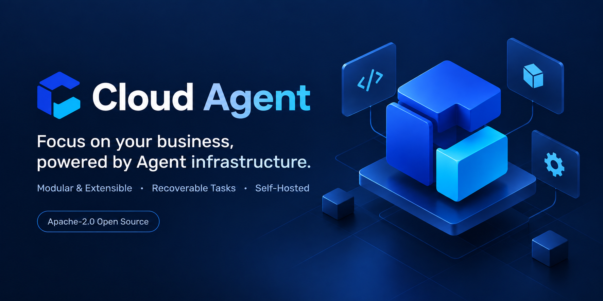
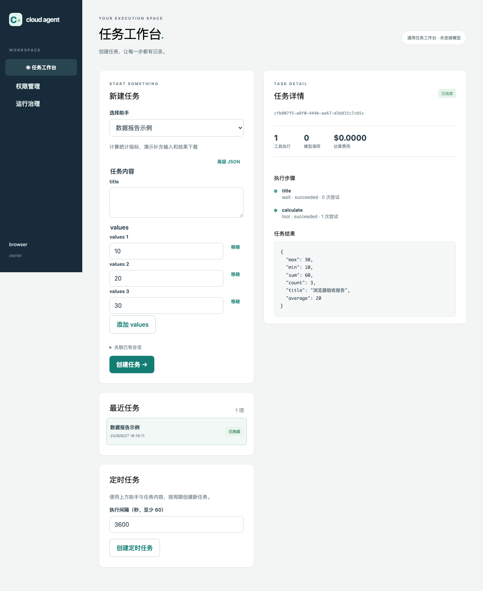

<p align="center">
  
</p>

<h1 align="center">Cloud Agent</h1>

<p align="center"><strong>Focus on your business, powered by Agent infrastructure.</strong></p>

<p align="center">
  <a href="https://github.com/seekskyworld/cloud-agent/actions/workflows/ci.yaml"></a>
  <a href="LICENSE"></a>
  <a href="docs/development.md"></a>
  <a href="tsconfig.json"></a>
</p>

<p align="center">
  <strong>English</strong> · <a href="README.zh-CN.md" lang="zh-CN">简体中文</a>
</p>

<p align="center">
  <a href="docs/getting-started.en.md">Getting started</a> ·
  <a href="docs/README.en.md">Documentation</a> ·
  <a href="docs/business-reuse.md">Business integration (中文)</a> ·
  <a href="AGENTS.md">Agent guide (中文)</a> ·
  <a href="CONTRIBUTING.md">Contributing (中文)</a> ·
  <a href="https://github.com/seekskyworld/cloud-agent/issues">Issues</a>
</p>



A durable, permission-aware task and agent framework in TypeScript. Add business modules and adapters; reuse scheduling, checkpoints, tool approvals, waits, and audit records.

Built for developers and coding agents to create their own Agent applications with self-hosting, business extensions, and reusable infrastructure.

## Run

Requirements: Node.js 24 LTS and Docker Compose. From the repository root:

```sh
node scripts/init-env.mjs
docker compose up -d --build --wait
```

Open <http://localhost:3100>. **No token or model key is required.** Skip initialization when `.env` already exists; it generates new database passwords and never overwrites your configuration. The service binds to localhost and uses `default/owner`, a superadmin on a new installation. Stop with `docker compose stop`; run the Compose command again to restart.

| Module            | Example                                                          |
| ----------------- | ---------------------------------------------------------------- |
| `report`          | Real statistics, a missing-title input wait, and a JSON artifact |
| `reviewed-report` | Confirm calculation parameters; no external write                |
| `text`            | Explicit demo echo; actual model calls require Pi configuration  |



Screenshot from an isolated example environment.

## Extend and deploy

The API and Worker run separately on PostgreSQL; no Redis is required. Register business modules in `modules/catalog.ts` and inject adapters in `apps/container.ts`. Use `pnpm module:create my-module` to scaffold and register a module. The React/Astryx workbench generates input forms from its schema. Detailed guides currently use Chinese:

- Build a business integration: [architecture](docs/cloud-agent-architecture.md) → [modules and adapters](docs/modules.md).
- Modify code or clients: [development](docs/development.md), [API](docs/api.md), and [contributing](CONTRIBUTING.md).
- Deploy and upgrade: [operations](docs/operations.md), [permissions](docs/administration.md), and [changelog](CHANGELOG.md).

Local mode shares one identity; multi-user use needs authentication. Approvals belong to the task owner or an explicitly scoped delegate. Current limits include application-level workspace isolation and no dynamic plugin sandbox, complete multi-tenant SaaS, or automatic checkpoint migration. Remote writes depend on external idempotency or reconciliation; cancellation cannot undo them. Real providers and business systems need separate integration testing.

Optional [multi-mailbox integration](docs/operations.md#可选邮件通道) supports AgentMail and standard IMAP/SMTP, isolated accounts, incoming tasks, input/approval replies, and a durable outbox. OAuth tokens must be supplied and refreshed externally. It is disabled by default and requires mailbox credentials and explicit sender bindings.

Optional [extension infrastructure](docs/extending.md) includes signed webhooks, scoped connections and credentials, local/S3 file artifacts, per-module model profiles, and fair admission quotas. Use `pnpm doctor` for offline configuration checks and `pnpm extension:create mail|channel <id>` for connector scaffolds.

Business packages use `pnpm package:create my-business`, `cloud-agent/sdk`, deployment resource bindings and separate static UI registration. The browser-safe `cloud-agent/client` validates core API contracts; `/v1/openapi.json` documents the public platform routes. Optional context providers preserve authorized snapshots, and structured model results are schema-validated. See the [integration guide](docs/extending.md) and [API reference](docs/api.md).

For application integration, start with the [business reuse guide](docs/business-reuse.md) (Chinese): transactional mail, controlled service receipts, composed approvals, optional cookies/public pages, and recovery checks reuse existing framework services.

The optional application package protocol contributes migrations, protected routes, durable jobs and static UI pages. No domain-specific applications are bundled; register your own packages and typed ports through the static manifests. `pnpm sdk:build` produces an independently consumable `@cloud-agent/sdk` artifact (not published to npm). Deployment revisions, process execution, OIDC, scoped delegation, child tasks, explicit memory, cost reservations and joint database/object recovery are opt-in; local mode still needs no token. See the [extension guide](docs/extending.md) and [operations guide](docs/operations.md) for supported boundaries.

## License

Apache-2.0: [LICENSE](LICENSE), [NOTICE](NOTICE). Dependencies retain their [own licenses](THIRD_PARTY_NOTICES.txt). `private: true` prevents accidental npm publishing; this is an open-source application. Report vulnerabilities according to [SECURITY.md](SECURITY.md).

Maintenance and compatibility: [support](SUPPORT.md), [governance](GOVERNANCE.md), [contributing](CONTRIBUTING.md). Source/SDK release candidates include provenance, checksums and an SBOM; see [artifact preparation](docs/development.md#候选交付包). CI does not publish packages or images automatically.
