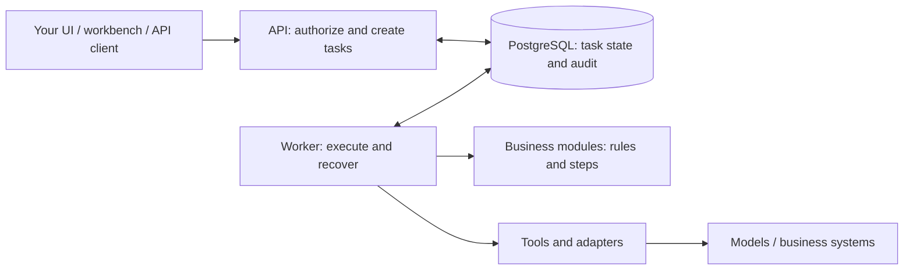

<p align="center">
  
</p>

<h1 align="center">Cloud Agent</h1>

<p align="center"><strong>Focus on your business, powered by Agent infrastructure.</strong></p>

<p align="center">
  <a href="https://github.com/seekskyworld/cloud-agent/actions/workflows/ci.yaml"></a>
  <a href="LICENSE"></a>
  <a href="docs/development.md"></a>
  <a href="tsconfig.json"></a>
</p>

<p align="center">
  <strong>English</strong> · <a href="README.zh-CN.md" lang="zh-CN">简体中文</a> ·
  <a href="docs/README.en.md">Docs</a> ·
  <a href="docs/getting-started.en.md">Getting started</a> ·
  <a href="CONTRIBUTING.md">Contributing</a> ·
  <a href="SUPPORT.md">Support matrix</a> ·
  <a href="#links">Links</a>
</p>

**Build business agents, not the same infrastructure twice.**

Cloud Agent is a **Business Agent Framework**: a reusable engineering foundation for building and evolving business AI applications.

Business agents often need tasks that survive restarts, wait for people, enforce permissions and interact with existing systems. Rebuilding those mechanisms for each business means repeating the same engineering work.

Cloud Agent brings that common code into one framework. Define your business rules in modules, connect your systems through adapters, and reuse the execution infrastructure across applications. You own the application, its data and how it evolves.


## Why Cloud Agent?

- **Reusable** — Carry task execution, recovery, approvals and audit into the next business agent. Common improvements can benefit every integration that uses them.
- **Extensible** — Add or replace modules, adapters and business packages as requirements change. Prefer extending these boundaries over modifying the core execution engine.
- **Business-oriented** — Build flows that wait for input, require approval, resume work and deliver results. Keep domain rules, external systems and your own UI under your control.

### One foundation, different business agents

| Application you could build | What you implement                                     | What you reuse                                      |
| --------------------------- | ------------------------------------------------------ | --------------------------------------------------- |
| Report agent                | Data sources, calculations and report format           | Task execution, input waits and result delivery     |
| Mail processing agent       | Message interpretation, routing and reply policies     | Mail connectors, identity checks and durable outbox |
| Internal process agent      | Business rules, system adapters and domain permissions | Tool approvals, recovery and execution audit        |

These are integration possibilities, not a catalog of ready-made applications. The repository includes neutral examples; your business code supplies the differences. **Reuse the infrastructure. Build only what makes your business different.**

## Try the execution flow

With Node.js 24 LTS and Docker Compose, run from the repository root:

```sh
node scripts/init-env.mjs
docker compose up -d --build --wait
```

Open <http://localhost:3100>. **No token or model key is required for the local demo.** Skip initialization if `.env` already exists. The service binds to localhost and uses a shared development identity.

1. Select `report` and submit the example values without a title. The task waits for your input.
2. Supply a title. The task resumes, calculates statistics and offers a JSON result. Refresh the page: the task and result remain available.
3. Try `reviewed-report` to confirm the calculation parameters before execution. The `text` example uses a demo echo until you configure a real model.


Screenshot from an isolated example environment. Stop with `docker compose stop`; data is retained. Follow the [getting started guide](docs/getting-started.en.md) to add a package and verify recovery across a Worker restart.

## Build your first business agent

Start in the [development environment](docs/development.md#本地热更新) (Chinese), install dependencies, then generate a small package:

```sh
pnpm install --frozen-lockfile
pnpm package:create greeting
pnpm exec tsx --conditions=development --test modules/greeting-package/contract.test.ts
```

The generator creates the package and registers it. The [runnable tutorial](docs/getting-started.en.md#add-a-neutral-package) covers enabling it, granting its capability and submitting the first task.

| Change                                          | Where your code goes                                            |
| ----------------------------------------------- | --------------------------------------------------------------- |
| Inputs, rules, execution steps and results      | Generated `modules/greeting-package/index.ts`                   |
| Package registration                            | `modules/packages.ts`, updated by the generator                 |
| External systems or domain storage, when needed | Adapters and typed ports, assembled in `apps/business-ports.ts` |
| Custom pages, when needed                       | Business components registered in `modules/business-views.ts`   |

Enable the package through `BUSINESS_PACKAGES` and explicitly grant its capability to existing identities. A single module can also start with `pnpm module:create my-module`, which updates `modules/catalog.ts`.

In the tutorial, a greeting rule becomes a tool that requires approval. You change the package code and configuration; the framework provides the task API, approval records, restart recovery and audit. As the business grows, add its own routes, data migrations, jobs or pages through the [business package interfaces](docs/extending.md#完整应用与独立制品) (Chinese).

For developers and coding agents: start with the [business reuse guide](docs/business-reuse.md) and [module contracts](docs/modules.md) (Chinese). Validate authorization, failures, recovery and external side effects as well as the successful path. Use the existing extension points first, and evolve the core when a requirement is shared across businesses.

## How the pieces fit



The TypeScript API and Worker run separately on PostgreSQL; no Redis is required. Modules describe the business flow, tools and adapters perform external actions, and the runtime tracks execution. See the [architecture](docs/cloud-agent-architecture.md) for contracts and recovery semantics (Chinese).

| Layer                           | Available capabilities                                                                          | Start here                                                                                                     |
| ------------------------------- | ----------------------------------------------------------------------------------------------- | -------------------------------------------------------------------------------------------------------------- |
| Core framework                  | Task lifecycle, durable steps, waits, approvals, access checks and audit                        | [Modules](docs/modules.md)                                                                                     |
| Optional infrastructure         | AgentMail or IMAP/SMTP, signed webhooks, connections, local/S3 files, model profiles and quotas | [Extensions](docs/extending.md), [mail](docs/mail-architecture.md)                                             |
| Business development interfaces | SDK, HTTP API, packages, custom pages and context providers                                     | [Business reuse](docs/business-reuse.md), [API](docs/api.md), [external packages](docs/external-extensions.md) |

These guides currently use Chinese. Enable only the integrations you need; real providers require credentials, configuration and separate validation. OAuth authorization and token refresh are supplied by the host. The SDK can be built as an independent tarball; it is not currently published to npm.

## Build and operate your own application

Self-host, adapt the code and maintain your own business packages under Apache-2.0. Cloud Agent supplies reusable execution mechanisms; you choose the domain model, integrations and application experience.

Before multi-user deployment, configure authentication. Workspace isolation is enforced by application code; deployed modules are trusted code, with no dynamic plugin sandbox or automatic checkpoint migration. Remote writes still need business-specific idempotency or reconciliation, and cancellation cannot undo an action already taken. See [supported boundaries](SUPPORT.md) and [operations](docs/operations.md) (Chinese).

For deeper work: [documentation index](docs/README.en.md), [development and verification](docs/development.md), [permissions](docs/administration.md), [model lifecycle](docs/model-lifecycle.md), and [release preparation](docs/development.md#候选交付包).

## Links

- [Repository](https://github.com/seekskyworld/cloud-agent)
- [Releases](https://github.com/seekskyworld/cloud-agent/releases)
- [Issues](https://github.com/seekskyworld/cloud-agent/issues)
- [LINUX DO — community discussion](https://linux.do/)
- [Documentation](docs/README.en.md)
- [Business integration (中文)](docs/business-reuse.md)
- [Agent development guide (中文)](AGENTS.md)

## Contributing and license

Share a reusable improvement, add an adapter, or improve the guides. See [contributing](CONTRIBUTING.md), [governance](GOVERNANCE.md), [security](SECURITY.md) and [changelog](CHANGELOG.md).

**Apache-2.0** permits use, modification and commercial distribution under its terms: [LICENSE](LICENSE), [NOTICE](NOTICE). Dependencies retain their [own licenses](THIRD_PARTY_NOTICES.txt). `private: true` prevents accidental npm publishing; source and SDK delivery are described in the development guide.
