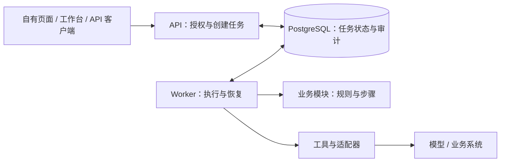

<p align="center">
  
</p>

<h1 align="center">Cloud Agent</h1>

<p align="center"><strong>专注业务，复用 Agent 基础设施</strong></p>

<p align="center">
  <a href="https://github.com/seekskyworld/cloud-agent/actions/workflows/ci.yaml"></a>
  <a href="LICENSE"></a>
  <a href="docs/development.md"></a>
  <a href="tsconfig.json"></a>
</p>

<p align="center">
  <strong>简体中文</strong> · <a href="README.md" lang="en">English</a> ·
  <a href="docs/README.md">文档</a> ·
  <a href="docs/getting-started.md">快速开始</a> ·
  <a href="CONTRIBUTING.md">参与贡献</a> ·
  <a href="SUPPORT.md">支持范围</a> ·
  <a href="#links">Links</a>
</p>

**每做一个业务 Agent，不必重新造一遍基础设施。**

Cloud Agent 是一个 **Business Agent Framework（业务 Agent 工程框架）**：将通用能力沉淀下来，帮助开发者持续构建和演进自己的业务 AI 应用。

开发一个新 Agent，除了调用模型，还要处理任务调度、状态管理、工具调用、人工审批、失败恢复和外部系统接入。每个业务都从头实现，意味着重复投入同一类工程工作。

Cloud Agent 将这些共性放进可复用的框架。你通过模块定义业务规则，通过适配器连接已有系统，让不同应用共享执行基础设施，并保留对业务代码、数据和应用形态的控制。


## 为什么选择 Cloud Agent？

- **Reusable · 持续复用**：任务执行、恢复、审批和审计可以用于下一个业务 Agent；共用能力的改进也能持续惠及接入它的业务。
- **Extensible · 按需扩展**：需求变化时，新增或替换模块、适配器和业务包，优先通过扩展点接入，减少对核心执行引擎的修改。
- **Business-oriented · 面向业务**：支持等待输入、人工确认、恢复执行和结果交付；业务规则、外部系统和自有页面由你定义。

### 同一套基础，构建不同的业务 Agent

| 可以构建的应用 | 你实现的业务差异             | 复用的通用能力                   |
| -------------- | ---------------------------- | -------------------------------- |
| 报告生成 Agent | 数据来源、计算规则和报告格式 | 任务执行、补充输入和结果交付     |
| 邮件处理 Agent | 来信解析、业务路由和回复策略 | 邮箱连接器、身份校验和持久发件箱 |
| 内部流程 Agent | 业务规则、系统适配和领域权限 | 工具审批、失败恢复和执行审计     |

这些是可接入方向，不代表已经内置对应的完整应用。仓库提供中立示例，具体业务由接入方实现。**通用能力持续积累，业务能力按需组合。**

## 先体验一次执行流程

准备 Node.js 24 LTS 和 Docker Compose，在仓库根目录执行：

```sh
node scripts/init-env.mjs
docker compose up -d --build --wait
```

打开 <http://localhost:3100>，**本地体验无需 Token 或模型密钥**。已有 `.env` 时跳过初始化。服务仅绑定本机，使用共享开发身份。

1. 选择 `report`，提交示例数值并留空标题，观察任务进入等待输入状态。
2. 补充标题，任务继续计算并提供 JSON 下载。刷新页面，任务和结果仍然可读。
3. 试用 `reviewed-report`，体验执行前确认实际参数。`text` 默认明确回显“未调用模型”，配置真实模型后才会调用。


截图来自隔离示例环境。停止服务用 `docker compose stop`，数据会保留；按 [入门教程](docs/getting-started.md) 接入自己的包，并验证 Worker 重启后的恢复。

## 新增一个业务，具体改什么？

先准备独立的 [开发环境](docs/development.md#本地热更新)，安装依赖后生成一个小业务包：

```sh
pnpm install --frozen-lockfile
pnpm package:create greeting
pnpm exec tsx --conditions=development --test modules/greeting-package/contract.test.ts
```

生成器会创建并注册业务包。按 [可运行教程](docs/getting-started.md#创建自己的中立包) 启用配置、授予能力并提交首个任务。

| 要修改的内容                   | 代码位置                                             |
| ------------------------------ | ---------------------------------------------------- |
| 输入、业务规则、执行步骤和结果 | 生成的 `modules/greeting-package/index.ts`           |
| 业务包注册                     | `modules/packages.ts`，由生成器更新                  |
| 外部系统或领域存储，按需接入   | 适配器与类型化端口，由 `apps/business-ports.ts` 装配 |
| 自定义页面，按需接入           | 业务组件，通过 `modules/business-views.ts` 注册      |

通过 `BUSINESS_PACKAGES` 启用包，并为已有身份显式授予相应能力。只有单个模块时，也可以用 `pnpm module:create my-module` 起步，生成器会更新 `modules/catalog.ts`。

教程把一个问候规则扩展为“确认后执行”的工具步骤：你修改包代码和配置，任务 API、确认记录、重启恢复及审计由框架复用。业务变复杂后，再通过 [业务包接口](docs/extending.md#完整应用与独立制品) 增加自己的路由、数据迁移、作业或页面。

开发者与 Coding Agent 从 [业务复用指南](docs/business-reuse.md) 和 [模块协议](docs/modules.md) 开始，按需验证授权、异常、恢复及外部副作用。优先扩展已有机制；出现新的共性需求时，再演进核心，不承诺任意业务都能零改动接入。

## 各部分如何协作？



项目采用 TypeScript 模块化架构，API 与 Worker 独立运行，共用 PostgreSQL，无需 Redis。模块描述业务流程，工具和适配器执行外部操作，运行时记录执行进度。协议及恢复语义见 [架构说明](docs/cloud-agent-architecture.md)。

| 能力层次     | 可以复用什么                                                                 | 阅读入口                                                                                          |
| ------------ | ---------------------------------------------------------------------------- | ------------------------------------------------------------------------------------------------- |
| 核心框架     | 任务生命周期、持久步骤、等待、审批、权限校验和审计                           | [模块与适配器](docs/modules.md)                                                                   |
| 可选基础设施 | AgentMail 或 IMAP/SMTP、签名 Webhook、连接凭据、本地/S3 文件、模型配置和配额 | [通用扩展](docs/extending.md)、[邮件架构](docs/mail-architecture.md)                              |
| 业务开发接口 | SDK、HTTP API、业务包、自定义页面和上下文提供器                              | [业务复用](docs/business-reuse.md)、[API](docs/api.md)、[仓库外扩展](docs/external-extensions.md) |

只启用需要的集成。真实供应商需要凭据、配置与独立联调，OAuth 授权及令牌刷新由宿主提供。SDK 可构建为独立 tarball，目前尚未发布 npm。

## 构建和维护自己的应用

你可以按 Apache-2.0 自部署、修改代码并维护自己的业务包。框架承载通用执行机制，领域模型、外部集成和应用体验由你选择。

多人部署前需要配置认证。工作区采用应用层隔离，模块是可信部署代码，当前没有动态插件沙箱或自动检查点迁移。外部写入仍需业务实现幂等或结果查询，取消任务不能撤销已经发生的动作。适用范围见 [支持说明](SUPPORT.md)，部署、升级及恢复见 [运维指南](docs/operations.md)。

深入使用：[文档索引](docs/README.md)、[开发与验证](docs/development.md)、[权限管理](docs/administration.md)、[模型生命周期](docs/model-lifecycle.md)、[候选包交付](docs/development.md#候选交付包)。

## Links

- [项目仓库](https://github.com/seekskyworld/cloud-agent)
- [版本发布](https://github.com/seekskyworld/cloud-agent/releases)
- [问题反馈](https://github.com/seekskyworld/cloud-agent/issues)
- [LINUX DO — 社区交流](https://linux.do/)
- [文档中心](docs/README.md)
- [业务接入](docs/business-reuse.md)
- [Agent 开发约定](AGENTS.md)

## 贡献与许可

欢迎提炼可复用能力、增加适配器或完善接入指南。协作方式见 [贡献指南](CONTRIBUTING.md)、[维护规则](GOVERNANCE.md)、[安全策略](SECURITY.md) 和 [变更记录](CHANGELOG.md)。

**Apache-2.0** 允许按条款使用、修改和商业分发，完整文本见 [LICENSE](LICENSE) 与 [NOTICE](NOTICE)。第三方依赖保留 [原有许可](THIRD_PARTY_NOTICES.txt)。`private: true` 仅防止误发 npm，源码与 SDK 交付方式见开发指南。
