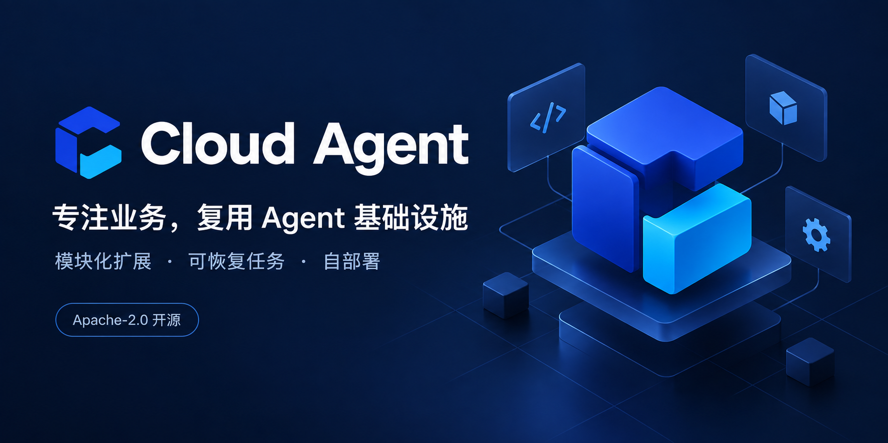

<p align="center">
  
</p>

<h1 align="center">Cloud Agent</h1>

<p align="center"><strong>专注业务，复用 Agent 基础设施</strong></p>

<p align="center">
  <a href="https://github.com/seekskyworld/cloud-agent/actions/workflows/ci.yaml"></a>
  <a href="LICENSE"></a>
  <a href="docs/development.md"></a>
  <a href="tsconfig.json"></a>
</p>

<p align="center">
  <strong>简体中文</strong> · <a href="README.md" lang="en">English</a>
</p>

<p align="center">
  <a href="docs/getting-started.md">快速开始</a> ·
  <a href="docs/README.md">文档</a> ·
  <a href="docs/business-reuse.md">业务接入</a> ·
  <a href="AGENTS.md">Agent 开发约定</a> ·
  <a href="CONTRIBUTING.md">贡献指南</a> ·
  <a href="https://github.com/seekskyworld/cloud-agent/issues">问题反馈</a>
</p>



**可恢复、受权限约束的通用任务与 Agent 框架。** 业务写成模块，模型和外部系统通过适配器接入；框架负责排队、分步执行、工具确认、等待恢复和审计。

面向开发者与 Coding Agent，支持自部署和业务扩展，复用通用基础设施构建自己的 Agent 应用。

## 运行

准备 Node.js 24 LTS 和 Docker Compose，在仓库根目录执行：

```sh
node scripts/init-env.mjs
docker compose up -d --build --wait
```

打开 <http://localhost:3100>，**默认无需 Token 或模型密钥**。已有 `.env` 时跳过初始化。初始化生成随机数据库密码，不覆盖已有配置；服务仅绑定本机，使用固定身份 `default/owner`，新安装时为超级管理员。

| 示例              | 可以体验什么                                       |
| ----------------- | -------------------------------------------------- |
| `report`          | 真实统计计算；缺标题时等待补充，完成后下载 JSON    |
| `reviewed-report` | 确认实际参数后计算；不写入外部系统                 |
| `text`            | 默认明确回显“未调用模型”；配置 Pi 后才调用真实模型 |

先选择报告示例，创建任务并补充标题即可走完流程。停止服务用 `docker compose stop`，再次运行上面的 Compose 命令即可启动。


截图来自隔离示例环境。

## 扩展

采用 TypeScript 模块化代码库，API 与 Worker 独立运行，共用 PostgreSQL，无需 Redis。新增业务通常只需模块、适配器及必要页面，不需要改 Worker。简单模块用 `pnpm module:create my-module`；完整业务用 `pnpm package:create my-business` 生成独立包，通过公共 SDK 声明权限和基础设施依赖，工作台自动生成输入表单。

| 目标                        | 阅读入口                                                                   | 修改位置                                      |
| --------------------------- | -------------------------------------------------------------------------- | --------------------------------------------- |
| 理解架构、接入业务或模型    | [架构](docs/cloud-agent-architecture.md) → [模块与适配器](docs/modules.md) | `modules/`、`adapters/`、`modules/catalog.ts` |
| 修改代码、页面或 API 客户端 | [开发](docs/development.md)、[API](docs/api.md)                            | `packages/`、`apps/`；页面使用 React + Astryx |
| 部署、升级和管理权限        | [运维](docs/operations.md)、[权限](docs/administration.md)                 | `compose.yaml`、`scripts/`、`migrations/`     |

可选 [多邮箱通道](docs/operations.md#可选邮件通道) 支持 AgentMail 与标准 IMAP/SMTP、多账户隔离、收信创建任务和持久回复；默认关闭。配置、身份绑定和 OAuth 适用范围见运维指南，协议与设计见 [邮件架构](docs/mail-architecture.md)。

可选 [通用扩展](docs/extending.md) 提供签名 Webhook、共用连接凭据、本地/S3 文件、多模型配置和公平配额。新增供应商通过带 Schema 的静态注册接入；`pnpm doctor` 检查配置，三个可选示例展示 API 查询、文件生成和消息确认。

业务接入还提供 [公共客户端与 OpenAPI](docs/api.md#公共契约与客户端)、[独立页面/上下文/结构化输出](docs/extending.md#独立业务包与-sdk-v1) 以及可审计的未知写入人工恢复。

接入业务时先看 [业务复用指南](docs/business-reuse.md)：同库事务发件、受控服务回执、确认组合、可选 Cookie/公开页面和恢复检查均通过已有框架扩展接入。

完整业务包可贡献迁移、API、作业和页面；框架不内置具体领域业务，接入方通过静态清单和类型化端口装配自己的包。框架还提供部署修订、执行池、进程隔离、追踪与成本治理，以及数据库/对象联合恢复。接入步骤和限制见 [扩展](docs/extending.md) 与 [运维](docs/operations.md)。

## 当前边界

免登录模式共享身份，多人使用需接入认证。工作区为应用层隔离；支持任务级限时委托审批；支持 JSON 及可选本地/S3 文件产物。模块随代码发布，无动态插件沙箱、完整多租户 SaaS 或自动检查点迁移。

外部写入可靠性依赖业务系统的幂等或结果查询；取消任务不会撤销已发生的外部动作。真实模型和业务系统需分别联调。

## 贡献与许可

见 [贡献指南](CONTRIBUTING.md)、[维护规则](GOVERNANCE.md)、[安全策略](SECURITY.md) 和 [变更记录](CHANGELOG.md)。候选交付包可通过 [开发指南](docs/development.md#候选交付包) 生成和校验，包含源码、SDK、SBOM 与来源提交。框架采用 **Apache-2.0**，允许按条款使用、修改和商业分发，完整文本见 [LICENSE](LICENSE) 与 [NOTICE](NOTICE)。第三方许可见 [THIRD_PARTY_NOTICES.txt](THIRD_PARTY_NOTICES.txt)。`private: true` 仅防止误发 npm，宿主交付为源码应用，`pnpm sdk:build` 产出可独立打包的 `@cloud-agent/sdk` 制品；尚未发布 npm。
