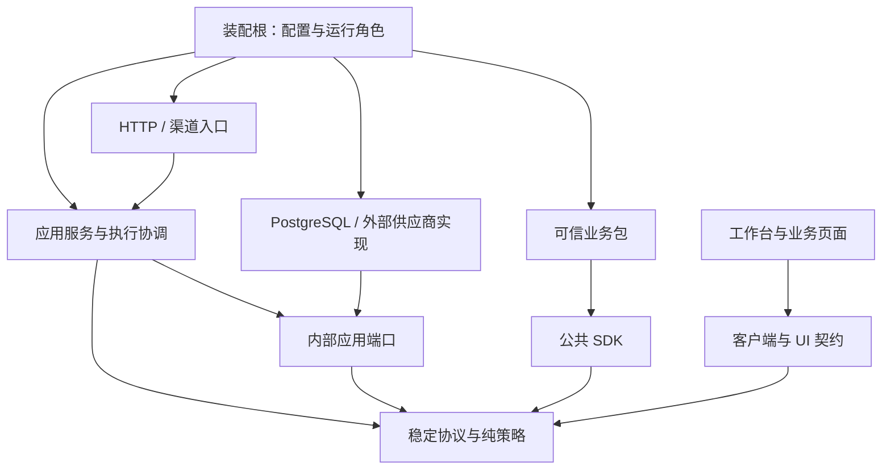

# 分层解耦与扩展性规划

评审基线：`aac7afe`，2026-09-27。**状态：本轮规划项已实施并通过回归。** 本文承接已完成的功能演进，不将已有 SDK、供应商接口、邮件、部署治理或开源交付重复列为待建设能力。当前行为见 [架构](cloud-agent-architecture.md)。

本轮落地内容包括：纯指纹/部署协议与 PostgreSQL 分离；任务服务、重核、工具执行和业务请求使用内部端口；API 不再直接写业务审计 SQL；启动返回经过校验的无秘密资源清单；邮件通知 SQL 收敛到 MailStore；边界检查升级为 TypeScript AST 图检查；容量基准支持可配置工作区和 Worker 数。既有事务与公共接口保持兼容。

## 结论与适用范围

当前是有持久执行与权限约束的模块化框架，业务和供应商边界已有基础；内部应用服务、运行时与 PostgreSQL 实现仍有耦合。新增一个业务或邮箱供应商通常不需要改 Worker，但更换内部存储实现、裁剪运行角色、独立测试应用规则仍不够直接。不能据此承诺任意业务都可无改造接入。

建议继续采用**模块化单体代码库，API 与 Worker 独立进程部署**。下一轮重点是稳定内部端口、明确资源归属、统一装配清单和补足接入契约验证。PostgreSQL 继续承担持久任务与事务；通用性优先体现为业务、供应商和交付方式可扩展，而非立即支持任意数据库或执行语义。

| 分层 | 已有基础 | 主要改进点 |
| --- | --- | --- |
| 业务与 SDK | 版本化业务包，逻辑资源绑定，路由/作业/页面/迁移贡献，类型化领域端口，独立 SDK 制品 | 后端、页面、诊断注册的一致性；第三方扩展的公共入口与契约测试 |
| 接入层 | HTTP、邮件、共用渠道走任务服务，API/客户端有协议基线 | 路由拿到整个 Container，部分接口直接操作数据库 |
| 应用层 | TaskService 集中任务操作与读取授权 | 依赖具体存储/身份/上下文类；任务、会话、通知、委托职责集中 |
| 执行层 | 纯 `next`，稳定步骤，工具副作用分类，租约、版本恢复、预算、父子任务 | Worker 同时管理租约、步骤分派和模型上下文/费用流程；基础设施类型渗入 |
| 基础设施 | 多模型、多邮箱、本地/S3 文件、可信连接与凭据接口 | 部分协议、应用规则和 SQL 同文件；PostgreSQL 事务助手跨目录引用 |
| 装配与运维 | 扩展注册、逆序关闭、doctor、部署指纹、独立收发循环 | API/Worker 使用同一完整装配；资源身份与诊断清单分散 |
| 开源交付 | 教程、许可、贡献治理、候选包、SDK 安装与契约验证 | 将内部边界、扩展兼容和规模测试变成持续门禁 |

## 源码依据

本轮检查了入口、装配、任务服务/Worker、关键事务、业务/供应商/UI 协议及交付入口，并对 `packages/apps/adapters/modules` 的 132 个 TypeScript 文件做 AST 导入分析。区分类型依赖与值依赖，再对去除类型后的输出核对循环。结果是静态结构证据，不代表已经发现线上故障或完成压力测试。

| 编号 | 位置与事实 | 对维护或扩展的影响 |
| --- | --- | --- |
| F1 | [TaskService](../packages/runtime/service.ts) 的构造参数是 TaskStore、IdentityService、WaitStore、SignalStore、ContextManager 等具体类型；[Worker](../packages/runtime/worker.ts) 还直接创建 ToolBroker | 应用规则测试和宿主替换需了解实现；`import type` 虽无运行时加载，仍不是独立端口 |
| F2 | [业务路由](../apps/api/business.ts) 直接写 `business_requests`；[治理路由](../apps/api/governance.ts) 创建 Deployments；[API 入口](../apps/api/app.ts) 将数据库传给限流函数 | 接入层绕过应用边界，业务调用审计、部署读取与限流难以独立复用 |
| F3 | [tasks.ts](../packages/persistence/tasks.ts) 创建 ReconciliationStore，后者从 [reconciliation.ts](../packages/persistence/reconciliation.ts) 反向导入 `event/ownedTask` | 确认一组文件级值导入循环；目前未证明初始化故障，但应移走共享事务助手 |
| F4 | persistence 导入 deployment 的修订函数、identity 的事务委托检查；后两者从 persistence 导入指纹/数据库代码 | 按目录聚合后的值依赖形成环；这与 F3 的文件循环不同。纯指纹函数位于 [database.ts](../packages/persistence/database.ts)，让纯逻辑引用含 `pg` 的模块 |
| F5 | [ContextManager](../packages/context/index.ts)、[ArtifactFiles](../packages/artifacts/index.ts)、[费用服务](../packages/observability/costs.ts) 混合规则与 SQL；[PolicyPort](../packages/identity/delegation.ts) 与具体委托存储同文件 | 换供应商已有接口，应用规则与元数据存储却仍绑在一起；无需因此重写数据库 |
| F6 | [createContainer](../apps/container.ts) 为 API 和 Worker 都装配模型、业务包、渠道、邮件及 Worker；[doctor](../apps/doctor.ts) 与 [业务装配](../apps/business.ts) 分别描述依赖清单 | 功能可选，但不同运行角色未充分裁剪；加入资源类型或自定义实例时要同步多处 |
| F7 | [MessageChannel](../packages/channels/channel.ts) 同时管理供应商、收件/发件 SQL 与任务映射；[MailNotifications](../packages/mail/notifications.ts) 经 `store.db` 直接写 SQL | 新渠道可复用接口，但基础投递机制与持久化封装仍需整理；已有共享失败分类和 ChannelTasks 不必重建 |
| F8 | [BusinessPage](../packages/business/application.ts) 声明导航；[BusinessView](../packages/ui/index.ts) 单独注册组件；[工作台](../apps/web/src/business-pages.tsx) 过滤没有组件的页面 | 遗漏前端注册可能表现为页面不出现。已有业务 OpenAPI 生成，不应重复建设一套 API 协议 |
| F9 | [边界脚本](../scripts/check-boundaries.mjs) 用正则检查少数禁止方向，没有完整内部依赖矩阵或循环分析 | 外层禁止反向导入已受保护，内部目录边界还不能自动约束 |
| F10 | TaskService 授权逐子任务递归，逐节点刷新身份/读取步骤；[claim](../packages/persistence/execution.ts) 使用全局准入事务锁；[数据库池](../packages/persistence/database.ts) 固定最大 20 连接 | 都是需测量的扩容点。全局锁保护共享配额，不能直接删除；现有小规模 benchmark 不能替代多进程与大任务树测试 |

把类型边计入后，runtime、persistence、identity、context、observability、deployment 也形成目录级依赖环。目标应是消除不必要的反向接口依赖，不能把这些类型关系一概描述为运行时循环。

## 目标依赖与职责

下图箭头表示源码依赖；基础设施通过实现端口接入，运行时调用方向可以与源码依赖方向不同。先在现有目录内整理职责，不一次性搬迁所有文件或发布大量 npm 包。

| 区域 | 允许依赖 | 不应直接依赖 |
| --- | --- | --- |
| 稳定协议/纯策略 | 必要 Schema 与纯函数 | 数据库、应用入口、供应商、业务实现 |
| 内部端口 | 稳定协议及自身输入输出 | `PoolClient`、Fastify、React、具体 Store 类 |
| 应用服务/执行协调 | 内部端口、协议、纯策略 | PostgreSQL SQL、供应商 SDK、全局 Container |
| PostgreSQL 实现 | 端口、协议、同一存储边界的事务助手 | Worker/TaskService 具体类、HTTP/UI |
| 外部适配器 | 供应商 SDK、所实现协议及显式注入能力 | 应用全局容器、未经授权的核心表访问 |
| 入口与 UI | 各自需要的服务接口/客户端协议 | SQL、迁移、服务端凭据、存储实现 |
| 装配根与运维工具 | 按角色需要的实现 | 具体领域规则；运维数据库访问不包装成业务能力 |

公共 SDK 与内部端口分开：内部接口首先服务宿主解耦，不因提取就自动纳入 SDK v1 的稳定承诺。数据库记录与外部 DTO 逐步显式映射，不在一次整理中重写所有字段或协议。

## 实施顺序与验收

阶段依次推进，每阶段完成自己的验收后再进入下一阶段。以下均未实施；复杂度表示相对改动与回归风险，不是工期承诺。

### 阶段一：建立可验证的边界（已完成）

**A1：清理依赖环并升级架构门禁，已完成。** 对应 F3、F4、F9。

- 将指纹、部署清单/修订计算移到不加载数据库的纯模块；`event/ownedTask/树锁` 留在 PostgreSQL 内部事务助手，消除 tasks 与 reconciliation 的循环。
- 用 TypeScript 解析与路径解析检查静态导入、导出、动态字面量导入及类型边；建立允许依赖矩阵。现有违规逐项列出，阶段推进时删除，不加目录级万能豁免。
- 保持原指纹字节、错误码、幂等摘要、部署修订完全一致；类型环与值环分别报告。
- **验收：** F3 循环清零；纯协议不加载 `pg`；代表性旧指纹逐字一致；新增反向导入和路径别名绕过被门禁拒绝。目录层 F4 的剩余问题随 A2/A3 完成清零。

**A2：提取按用例命名的内部端口，已完成首轮。** 对应 F1、F4、F5。任务端口保留了 PostgreSQL 实现的类型兼容桥，后续可在有独立宿主需求时继续下沉 DTO。

- 从实际调用面提取任务读取、任务命令、执行提交、等待/信号、当前身份、授权、模块目录等最小接口。存储依赖 ModuleCatalog 接口，不依赖完整 Registry。
- 逐项让现有 PostgreSQL 实现兑现接口；TaskService 不公开底层 Store。PolicyPort 与 SQL 委托检查分离，事务内权限复核仍留在 PostgreSQL 原子命令中。
- 保留现有外观与调用方式作为过渡，避免一次改动所有入口；不做通用 `Repository<T>` 或暴露任意 SQL 的“端口”。
- **验收：** 应用服务可用小型内存替身测试关键规则；生产仍用真实 PostgreSQL 合同测试；应用端口没有 `PoolClient` 或具体存储类；旧任务恢复、撤权、委托、取消和幂等语义保持。

**A3：收窄接入层能力，已完成。** 对应 F2。

- 路由仅注入 TaskQueries/TaskCommands、BusinessInvoker、DeploymentQueries、RequestAdmission 等必要能力，名称按最终实现收敛。
- 业务调用的校验、期限、当前权限复核和审计交给应用服务；POST 领域幂等仍由业务包兑现，超时后不能把未确认写入当成安全失败。
- **验收：** `apps/api` 无直接 SQL、无具体存储构造、无全量 Container 参数；相同请求的状态码、响应、权限和审计结果不变。限流事务实现可以继续用 PostgreSQL。

### 阶段二：按角色装配，隔离可选能力（已完成首轮）

**B1：共享资源描述与装配计划，已完成首轮。** 对应 F6、F8。资源清单已供装配根使用，doctor 仍保持原有诊断响应格式。

- 建立一份经过校验的资源描述：kind、id、非秘密 identity、依赖、协议版本、所属角色和关闭责任。描述与活跃连接实例分开；不要求异步凭据供应器变成静态配置。
- 配置解析、doctor、业务绑定检查和部署指纹消费同一解析结果；程序化注入与配置方式遵循相同校验。诊断仍可离线运行，不为得到清单而实例化连接器。
- 在已有 Resources 逆序关闭机制上区分宿主创建与外部借用资源，校验重复 ID、缺失依赖和依赖环；统一错误定位，但不把凭据写入清单或日志。
- **验收：** 相同输入下 doctor 与启动的依赖判定一致；旧指纹不变或有明确兼容策略；启动失败释放已创建资源，借用资源不被误关；缺失的业务页面实现可在构建/诊断时定位。

**B2：API/执行/后台/运维按需装配，已完成兼容首轮。** 对应 F6。当前默认仍可单进程装配全部循环，资源角色清单已建立；进一步物理裁剪实例需独立部署需求后再启用。

- 在共同清单上形成 API、执行 Worker、后台维护/投递和离线运维所需视图；保留单个 Worker 合并启动后台循环的默认体验。
- API 保留校验、读取授权及 Webhook 所需模块能力；不因角色裁剪而省略这些钩子。将模块元数据/授权需求与模型调用、发件循环等运行资源区分开，避免 API 无条件构造整套执行器。
- 对现有业务包的 `create` 提供兼容路径；若必须增补描述/角色入口，以可选能力演进，不强迫旧 SDK v1 包立刻迁移。明确部分旧包暂不能完整裁剪。
- **验收：** 用创建计数验证不同角色仅实例化所需资源；API、Worker 的模块指纹一致；禁用邮箱/文件/模型时不读取对应秘密；启动失败、SIGTERM、关闭错误和就绪检查均按角色验证。

### 阶段三：整理运行时与扩展协议（已完成首轮）

**C1：Worker 分离执行协调与步骤处理，已完成端口化首轮。** 对应 F1、F5。工具 Broker 已改为可注入端口，保留默认兼容构造；模型/等待/子任务的更细粒度拆分不改变现有状态机。

- Worker 保留领取、心跳、取消传播和统一终态提交；模型步骤负责请求/上下文/费用流程，工具步骤使用注入的受控执行接口，等待与子任务调用各自端口。
- 固定现有 Action 联合类型及状态机；模块仍用纯 `next` 编排。不能让任意动态 handler 绕过权限、审批、租约或副作用策略。
- 将上下文快照、产物元数据、成本账本的持久化收敛到命名存储接口，分别迁移，不建立一个涵盖全部功能的大服务。
- **验收：** 每类步骤都有权限/超时/恢复契约测试；旧租约提交被拒绝；未知写入不重发；成本不重复累计；配置无关模块的恢复指纹不变。

**C2：渠道与邮件复用稳定的小机制，已完成。** 对应 F7。

- 先让 MailNotifications 只调用 MailStore 方法，让 MessageChannel 的 SQL 收敛到渠道存储；统一注入任务入口、身份、通知读取等接口。
- 在已有 ChannelTasks 与 deliveryFailure 上抽取确实相同的去重、领取/回执状态转换和截止控制；邮件继续保留 RFC Message-ID、线程、UID、DKIM 等专属语义，不统一所有表或消息格式。
- 将供应商差异声明为能力并给出不支持行为；投递结果未知仍需核实，不能通过自动切换供应商重发。
- **验收：** 中立渠道和两种邮件适配实现共用适用的契约测试；重复收件、崩溃于发送后、撤权、关闭超时、供应商明确拒绝与未知状态均验证；新增供应商不改 TaskService/Worker。

**C3：扩展接入与 UI/API 一致性，已完成现有协议范围。** 对应 F8 及开源接入成本。

- 梳理业务 SDK 与供应商扩展宿主接口的公开面，补充独立供应商包消费验证，禁止依赖宿主源码深路径；新增公开能力走兼容审查。
- 保持可信构建期页面注册，为 package/page/module ID、SDK 主版本与前后端贡献建立校验；可选前端缺席明确标注为 headless，其他遗漏给出诊断。
- 基于现有路由 Schema/OpenAPI 生成业务客户端类型或调用描述；不创建第二套手写路由定义。`channel(alias)` 当前只返回绑定 ID，应文档化，确需主动通知时再增加受限发送端口。
- **验收：** 全新目录中的独立业务包和供应商包仅使用公开入口即可编译；接入页面无需改工作台核心；旧 SDK v1、无 React 的后端消费者、已有 API 基线继续通过。

### 阶段四：验证扩容边界与形成稳定交付（已完成基线）

**D1：先测量，再优化性能路径，已完成基准入口。** 对应 F10。`BENCHMARK_WORKERS` 与 `BENCHMARK_WORKSPACES` 支持固定并发组合；本轮未宣称新的吞吐指标。

- 扩展已有 benchmark：多进程 Worker、多个工作区/模块、历史事件、多层任务树、慢授权与慢供应商。记录查询数、P95/P99、锁等待、连接数、积压和公平性；固定数据与环境才比较前后结果。
- 树读取可批量加载，授权沿整个请求传播同一总截止；只在单次请求中复用安全快照，不能跨请求缓存绕过撤权。并发、树宽深和页面大小保持有界。
- 数据库池按进程角色配置并核算总连接预算；全局准入锁只有在测量证明瓶颈且替代方案维持全局配额时才调整。
- **验收：** 同环境功能与性能基线可复现；无饥饿、配额超卖和泄漏；优化前先登记目标指标与误差范围。本轮不预设未经测量的吞吐保证。

**D2：把架构要求纳入发布门禁，已完成。**

- 边界图、扩展契约、SDK/API 基线、最小运行组合和旧任务升级恢复纳入现有 CI；收敛教程中的入口与命令，不再新增平行指南。
- 新增内部端口不等于拆发布包；只有出现独立消费/依赖裁剪需求时再分制品。现有 root 工程包含多类可选供应商依赖，功能关闭并不等于安装依赖已裁剪。
- **验收：** 下表的接入场景都有独立中立夹具；文档可复现，候选包/SDK 消费验证通过。远端 CI 和发布须分别实证，不以本地检查代替。

## 重构不能拆散的原子边界

抽取端口按完整操作，而非把一笔事务拆为多个远程调用。以下仍由 PostgreSQL 实现一次性完成，业务网络请求在事务外：

| 操作 | 必须一起验证/提交 |
| --- | --- |
| 创建任务与定时触发 | 当前身份、幂等判定、模块/修订、任务写入；作业推进与创建任务不分家 |
| 领取与执行提交 | 共享配额、公平性、兼容性、租约；结果提交必须检查有效租约 |
| 等待响应/确认/信号 | 当前身份/委托、参数绑定、去重消费、步骤和任务重新入队 |
| 父子任务与取消 | 树锁、创建/取消传播、累计预算与状态；不能漏掉并发新增的子任务 |
| 上下文快照 | 有效租约与首次不可变快照写入；领域 ACL 仍由供应器复核 |
| 审计与未知结果核实 | 当前授权、版本/步骤状态、幂等核实记录、结果与事件 |

迁移只追加；优先先提接口、沿用旧实现，再逐处替换调用。每阶段可回退制品但不得删除旧数据/检查点或改写旧指纹。权限、幂等和未知副作用语义不以“简化代码”为由降级。

## 用接入成本验收通用性

| 场景 | 目标允许改动 | 应保持不变 |
| --- | --- | --- |
| 增加邮箱供应商 | 供应商包、配置 Schema、宿主注册及凭据绑定 | Worker、任务状态机、业务包 |
| 增加即时消息渠道 | 验签/消息映射/投递适配、资源绑定 | 任务授权、任务创建与恢复逻辑 |
| 增加模型或文件供应商 | 引擎/存储适配、能力/身份声明与装配 | TaskService、业务编排及旧供应商实现 |
| 增加独立业务 | 包的 schema/模块/路由/作业/领域端口及宿主绑定 | 平台核心表与 Worker 业务分支 |
| 增加业务页面 | 构建期组件注册及同源页面声明 | 工作台导航逻辑与核心组件 |
| 替换身份认证来源 | IdentityProvider 及可信身份映射 | 工作区/能力/领域授权规则；默认本地免 Token |
| 更换执行宿主 | ExecutionHost 实现、能力限制与装配 | 租约、审批、未知写入与版本规则；不是天然支持远程不可信执行 |
| 接外部事件消费者 | 在确有需求时增加版本化事件投递与消费游标 | 核心状态机；不能直接把内部审计表当稳定消息 API |

外部事件消费是后续需求入口，当前不承诺已有通用事件订阅平台。不同数据库、新 Action 类型、超大文件流式处理、不可信插件运行均涉及新的语义与运维条件，不属于“加一个适配器”即可完成的事项。

## 暂缓事项与验证范围

暂不引入微服务拆分、Kafka、通用 DAG 编辑器、热加载任意代码、全数据库兼容层。RLS、租户独立库/密钥和不可信沙箱在明确托管多租户需求与威胁模型后单独设计；当前应用级工作区隔离不应宣传为强租户隔离。长期记忆/RAG、实时语音、多模态与支付等能力由真实业务驱动，不提前塞进核心。

本轮已修改运行代码并完成类型、lint、AST 边界、格式、文档、工具门禁及 160 项隔离 PostgreSQL 集成回归；未连接真实模型、邮箱、S3 或用户实例。容量基准入口已扩展，但本轮未重新运行长时间压测；后续若调整调度锁或数据库池，仍需按 [Agent 约定](../AGENTS.md) 做固定环境容量对比和联合恢复。
