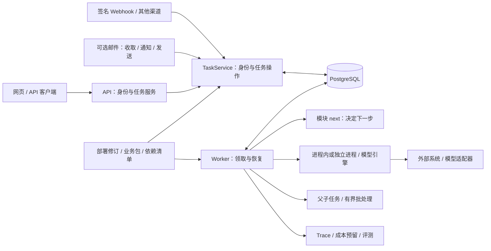

# 通用架构

Cloud Agent 把任务运行机制与业务规则分开：API 接收任务，Worker 分步推进，PostgreSQL 保存队列、步骤、等待、结果与审计。模块及适配器是随版本发布的可信代码。

## 代码放在哪里

| 位置 | 职责 |
| --- | --- |
| `packages/extensions/`、`channels/`、`connections/`、`artifacts/` | 扩展注册、资源清单、共用渠道、受控连接、文件产物端口 |
| `packages/business/`、`sdk/`、`api/`、`ui/`、`context/` | 业务包清单、公共 SDK/API/页面契约、可选授权上下文快照 |
| `packages/contracts/` | Module、Tool、ModelEngine、身份与状态协议 |
| `packages/runtime/`、`tool-execution/` | 注册、恢复、预算及受控执行 |
| `packages/persistence/`、`identity/`、`observability/` | 数据库、认证授权、健康与指标 |
| `modules/`、`adapters/` | 业务编排与外部协议 |
| `modules/catalog.ts`、`apps/container.ts` | 默认/历史模块清单与依赖装配 |
| `apps/api/`、`apps/worker/`、`apps/web/` | API、Worker、React/Astryx 工作台 |
| `migrations/`、`scripts/`、`tests/` | 数据迁移、运维与验证 |

外层依赖约束：核心 `packages/` 不导入应用、模块、适配器或模型 SDK；内部应用端口、工具执行端口和资源清单进一步收敛了运行时与装配依赖。当前边界与已实施改造见 [分层评审与规划](architecture-decoupling-plan.md)。外部系统保留权威业务数据，框架只保存执行所需的输入、输出和记录。

## 一次任务的生命周期

1. HTTP/邮件/渠道通过 TaskService 绑定当前可信身份，校验模块能力和输入，以幂等键保存任务及模块版本、配置摘要。
2. Worker 只领取匹配模块、版本和配置的任务并建立租约，复核身份；先恢复未完成步骤，否则调用纯函数 `next(input, steps)`。
3. 模块返回 `tool`、`model`、`wait`、`children` 或 `complete`。平台先持久化动作，再执行调用；模型每次仅一轮，工具执行权属于平台。
4. 保存步骤结果并重新排队，或进入等待；完成时保存 JSON 产物，工具可另外生成带鉴权引用的文件。等待不占 Worker，响应消费与重新排队在同一事务完成。

任务可处于排队、运行、等待输入/确认/外部结果、计划重试以及成功/失败/取消状态。网页断开不影响执行；租约默认 30 秒并续期，过期可接管，旧租约不能提交。取消停止后续推进，不能撤销远端动作。

## 必须理解的执行语义

| 工具 effect | 结果未知时如何处理 |
| --- | --- |
| `read` | 可按预算退避重试，不应产生业务副作用 |
| `idempotent_write` | 重用稳定动作 ID，远端必须兑现幂等 |
| `reconcilable_write` | 调用 `reconcile` 查询原动作结果 |
| `unsafe_write` | 暂停，不自动重发 |

平台不承诺跨系统副作用恰好一次。超时不代表未执行，未知写入可能进入无普通 wait 的 `waiting_external`；显式 retry 也受副作用策略和累计预算限制。成本预算用于调用准入，不是供应商硬账单上限。

确认由任务所有者或显式限时受托人执行并绑定实际参数，拒绝、过期或改参不能通过 retry 绕过。普通外部信号可早于等待到达，以任务和稳定 wait key 匹配，重复或取消后不会重复唤醒。

邮件作为可选通道接入：供应商验签/原件 → 显式身份映射 → 同一任务服务 → 持久通知。邮件投递有独立去重与不确定状态，不把供应商 API 接到业务 Worker 内部。实现位于 `packages/mail/`、`adapters/agentmail/` 与 `adapters/imap-smtp/`。账户清单与凭据供应器分离，MailHub 限并发调度；三个独立循环各有账户锁及健康记录，慢收件不阻塞发送，邮件循环失败不会停止任务 Worker。账户、供应商定位和 RFC Message-ID 分离；标准收件只读、校验完整 DKIM，OAuth 令牌由外部服务供应。详见 [邮件架构](mail-architecture.md)。

通用基础设施通过带 Schema 的静态注册表装配，凭据使用异步引用供应器；业务 HTTP 与模型连接在调用前复核工作区/用户/能力。文件独立存储在本地或 S3，元数据关联任务，下载仍经任务授权。每个模块可选择模型配置，指纹只绑定实际依赖；领取实行工作区/模块轮转及可选共享配额。接入与部署配置集中见 [通用扩展](extending.md)。

## 权限与兼容

工作区、管理角色、业务能力和领域 ACL 共同生效；超级管理员没有业务通配权限，任务、会话和产物仍限定所有者。API、Worker、工具均复核身份；模块用 `validateContext` 和 `authorizeRead` 校验外部资源，核心不解释其数据结构。详见 [权限](administration.md)。

任务绑定模块版本和配置指纹。`runtime` 声明模型及业务配置依赖，纯计算模块不受模型配置变化影响；未声明则保守绑定全局配置。默认使用同 ID 首个注册版本，可在清单显式选择默认版本，历史版本仍可恢复和读取。Worker 不抢领不兼容任务，列表用 `compatibility` 提示需兼容实例；不自动迁移检查点。卸载后列表保留 `available:false` 摘要，详情/产物拒绝读取，到期定时器停用。升级处理见 [运维](operations.md#升级)。

工作台按输入 Schema 生成表单，复杂结构保留 JSON；模块可注册输入和结果组件。健康探测只查询连接与执行/维护心跳，业务指标另行聚合。执行事件和调用尝试可由运维显式压缩归档，任务、幂等键、确认和审计继续保留，事件 API 合并冷热记录。

业务以独立包声明逻辑资源，宿主绑定实际连接、模型、文件、上下文和渠道；绑定身份进入恢复指纹。永久错误和授权错误终止、限流遵循等待窗口，未知写入可由有权限的所有者凭外部回执核实。可选上下文保存首次授权快照且复核 ACL，结构化模型输出由平台校验；不使用这些功能的旧模块指纹保持不变。

业务包可以贡献独立 schema 迁移、受保护路由、持久作业、静态页面与类型化领域端口。平台核心不识别具体领域字段，宿主默认不装配领域端口或页面；中立测试夹具只用于验证扩展契约。任务保存部署修订、模块指纹、执行池与标签；配置切换不改写旧任务。父子任务共享身份上限和累计预算，取消向下传播；补偿需业务显式声明工具并遵守审批规则。

可选 OIDC 映射到预先登记的身份，Token 可到期/撤销；委托只在同工作区的指定任务上生效。长期记忆显式写入、有期限和删除语义，读取快照仍复核来源版本与当前权限。MCP 是经过本地 Schema/能力/effect 映射的工具适配层。

运行治理包括有界调用、进程终止、瞬态错误退避、账户并发、兼容 Worker 就绪、OTel Trace、成本预留/核实、正文退役和联合备份。文件按元数据路由到多存储实例，幂等及审计墓碑独立于正文保留。

当前边界：应用层工作区隔离，无数据库 RLS、跨租户管理员、超 10 MB 文件、不可信代码沙箱或自动检查点迁移。独立进程不是安全沙箱；父子任务不是通用 DAG 编辑器，长期记忆不自动摘要或建向量索引。接入方法见 [模块与适配器](modules.md)。

模型调用拥有独立的持久账本：失联请求隔离、共享模型容量、可选远端取消/查询及有效增量超时由平台协调。迟到回执只更新调用与费用，不绕过任务租约；协议、配置和升级见 [模型调用生命周期](model-lifecycle.md)。
