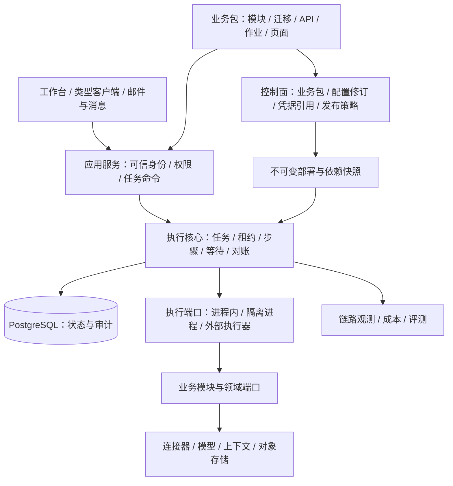

# Cloud Agent 架构评定与演进方案

评审基线：`8a7988c`，2026-09-27。全部 A–L 已实施。本文为历史评审记录；当前交付仅保留通用框架与中立示例，应用差异通过测试夹具验证。**阶段 0–4 已完成并通过隔离验收，证据见文末**。下方评定与方案描述保留评审时的状态，不表示现有代码仍缺少这些能力；当前结构见 [通用架构](cloud-agent-architecture.md)。此前接入改造见 [历史验收](business-integration-plan.md)。

## 原基线评定

当前适合作为**可信业务代码部署的、可恢复的任务型 Agent 基座**。报告处理、外部 API 操作、邮件/消息触发、人工确认和文件生成已有统一执行路径。任务可靠性与基础设施替换设计较完整，业务应用扩展、共享云运行治理和生态交付仍需继续补齐。

| 维度 | 评定 | 依据与限制 |
| --- | --- | --- |
| 核心与业务分离 | 较好 | 模块纯编排、适配器协议隔离、宿主装配、业务包 SDK；应用服务仍直接执行 SQL，部分持久层依赖 API 命令 Schema |
| 持久执行与恢复 | 较好 | 租约、幂等、等待、确认、错误分类、人工核实、版本指纹；工具与编排仍在 Worker 进程内运行 |
| 基础设施替换 | 较好 | 邮件、渠道、连接、文件、模型均有端口；业务 SDK 资源种类固定，文件宿主当前是单个 ArtifactFiles 实例 |
| 完整业务接入 | 已有基础 | 包可贡献模块，UI 可贡献输入/结果/操作组件；尚无完整的业务迁移、独立 API、后台作业和页面导航贡献协议 |
| 身份与权限 | 已有基础 | 工作区、角色、能力、所有者及领域 ACL 复核；默认固定身份，Token 认证，没有组织登录、委托审批和数据库 RLS |
| Agent 能力 | 已有基础 | 多模型配置、工具建议、上下文快照、结构化输出；模型消息以文本为主，记忆、多模态、任务组合和评测尚未形成产品能力 |
| 云运行与规模 | 需要实测和加强 | API/Worker 分进程、多 Worker、公平配额；任务领取全局准入锁、渠道串行、没有容量基线和执行资源隔离 |
| 开源交付 | 已有基础 | Apache-2.0、公共文档、生成器、CI 和接口；SDK 仍随源码应用交付，没有独立发布/兼容矩阵/长期支持政策 |

已有验收：133 项后端测试、5 项浏览器流程、镜像及隔离 Compose；核心行/分支/函数覆盖率 98.95% / 93.20% / 97.39%。这些结果证明已测场景，不等于生产 SLA、整体代码覆盖率或任意业务的即插即用保证。

## 目标结构

继续采用模块化代码库，保留 PostgreSQL 持久任务核心。先分清职责与稳定协议，再按运行需求分进程；不因目录增加就拆成微服务。

其中控制面管理“启用什么、绑定什么、使用哪个版本”，执行面只消费确定的快照并推进任务。逻辑职责分开即可，初期可以共用进程和数据库。

## 先做的可靠性收口

这些是现有实现边界的补强，不是重新开发已经完成的 SDK、邮件或恢复功能。

| 发现 | 影响 | 建议与验收 |
| --- | --- | --- |
| `abortable` 通过 Promise.race 结束等待，不能停止不合作的插件；`module.next` 同步执行，`validateContext/authorizeRead` 部分路径直接 await | CPU 阻塞、永不返回的钩子可能占住执行槽；退出等待没有统一总期限 | 为所有扩展钩子设置有界调用；增加执行器端口和退出总期限；用死循环、挂起钩子、子进程退出和迟到结果验证不拖垮其他任务 |
| `execute/maintain` 直接进入 Promise.all，数据库错误会触发整个 Worker 排空退出；通用渠道在一个循环串行 tick | 依赖抖动导致重启；慢渠道延迟后续渠道 | 明确可恢复/致命错误；有抖动的重连退避；渠道按账户有界并发，限定连接占用；验证单渠道挂起和数据库断连恢复 |
| `/health`、`/ready` 与普通请求共用全局限流；ready 只看全局近期心跳 | 探针可能被同 IP 流量限流；有心跳不代表存在兼容 Worker 或任务持续推进 | 探针独立于业务配额；增加兼容版本/执行池与推进状态视图；区分存活、可接流量、业务健康，避免把无任务的正常空闲判为故障 |
| TaskService 内部直接查表，ReconciliationStore 导入 `packages/api` 中的命令 Schema | API、应用服务和持久实现边界交叉，后续 SDK 拆分成本增加 | 命令/查询 DTO 下沉到中立协议；应用服务通过聚焦的仓储接口执行查询，事务边界留在持久层；增加内部依赖方向检查 |

只读钩子截止失败按明确错误返回；外部写入截止仍保留 unknown，隔离进程被终止也不等于远端未提交。上述变化必须保持现有取消、确认、幂等和对账不变量。

## 全面优化工作项

优先级按接入收益与运行风险确定：P0 为共享生产运行前应收口的可靠性边界；P1 为下一轮优先；P2 按业务需要启动。规模相关结构调整必须先有压测证据。大小是相对改造规模，不是工期承诺。

| 编号 | 方向 | 优先级 / 规模 | 业务收益 | 验收重点 |
| --- | --- | --- | --- | --- |
| A | 执行生命周期与进程隔离 | P0 / 大 | 单个重业务不拖垮其他 Agent | 阻塞/挂起/超时/退出恢复；迟到结果不能提交；未知写入不重发 |
| B | 完整业务包与领域端口 | P1 / 大 | 接入不同领域业务，减少修改平台目录 | 外部示例包贡献数据迁移、API、作业、页面；核心无业务分支 |
| C | 配置修订与版本生命周期 | P1 / 大 | 更换供应商、改配置、升级业务可控 | 预检、差异、启停、回退；旧任务仍使用原快照或兼容 Worker |
| D | 公共契约、仓储与 SDK 边界 | P1 / 中 | 人和 Agent 能稳定按公开接口改造 | 依赖规则、编译产物消费、API 差异检查、旧客户端兼容 |
| E | 观测、评测与成本策略 | P1 / 中至大 | 能判断业务是否有效、失败在哪、花了多少 | 一条任务贯通 Trace；离线评测与费用预算；观测不默认记录正文 |
| F | 调度、背压与渠道伸缩 | P1 先测 / 大 | 多业务并行时可控公平和容量 | 多租户混合压测、队列延迟、锁等待、慢渠道及数据库连接预算 |
| G | 身份、委托与策略端口 | P1 接口，P2 扩展 / 大 | 企业登录、多人协作和服务身份可接入 | 保留本地免 Token；跨工作区/撤权/委托过期/审批改参测试 |
| H | 模型、工具、上下文与可选 MCP | P1 协议，P2 实现 / 大 | 接入更多模型和工具，减少业务重复逻辑 | 能力协商、不支持明确拒绝、预算/引用/撤权、协议契约测试 |
| I | 可组合任务与业务流程 | P2 / 大 | 批处理、子任务、并行分支和跨人员流程复用 | 取消传播、预算合并、分支恢复、回执保留；补偿必须业务显式实现 |
| J | API 与工作台完整扩展 | P1 / 中 | 前端和外部 Agent 无需绕过平台接口 | 完整公开 API 契约、游标、业务页面、操作权限与故障恢复入口 |
| K | 数据生命周期与恢复 | P1 / 大 | 长期运行、业务卸载和灾难恢复有依据 | 数据分类、保留/导出/删除、幂等墓碑、数据库与对象联合恢复 |
| L | 开源发布与参考业务 | P1 / 中 | 第三方能独立安装、升级、验证自己的业务 | 独立包交付、版本矩阵、供应链检查、两个差异显著的参考业务 |

### A：把执行隔离做成可选择的运行方式

引入 `ExecutionHost`，先提供兼容的 in-process 实现，再提供独立进程实现；凭序列化动作与结果通信，不把函数闭包直接传给子进程。可信轻量工具仍可进程内执行，CPU 密集和长时工具放独立进程或受控外部执行器。增加执行槽、内存/CPU/时限策略、进程回收与优雅退出期限。

子进程隔离不等于安全沙箱。若需要执行不可信代码，再增加独立容器、文件/网络访问策略、短期能力凭据与更严格资源限制。无论哪种执行器，平台持有幂等键、租约和提交权。

### B：业务包从“模块集合”扩展为“应用贡献集合”

目前 BusinessPackage 工厂返回 modules/close；requires 只有五类固定基础设施，文件绑定对应宿主唯一存储实例。建议新增可选的领域端口、业务迁移、受保护路由、定时作业和 UI 导航贡献；模块/工具/路由/作业统一命名空间，检测冲突。

领域端口使用类型标识、配置 Schema、生命周期与版本身份，例如 `CustomerRepository`、`BillingGateway`；数据库可以由业务自建，也可使用宿主提供的受控持久适配。不要为了接新资源不断扩充核心 switch，也不要向业务默认暴露平台全部表。

业务迁移由部署阶段的专用角色执行，记录包名、版本、校验和及执行状态；运行 API 无 DDL 权限。包的路由自动绑定可信身份/权限/输入/审计约定。文件服务改为存储实例注册表，支持同一个部署中不同业务选择不同桶/目录，同时保留物理身份与下载授权。

### C：配置和升级成为可审阅的操作

将环境变量输入、配置校验和生效配置分离。增加“校验 → 预览差异 → 创建不可变修订 → 启用”的流程，任务保存有效修订引用；API 和 Worker 校验同一部署清单。第一版仍可从静态文件启动，无需立即引入在线配置数据库或界面。

明确兼容、非兼容、迁移三类变化；按模块声明实际消费的依赖生成指纹。目前整个业务包的配置与全部依赖进入每个模块指纹，后续可避免改无关依赖时阻断包内所有旧模块。不得为了继续执行而静默忽略指纹变化。

升级支持旧版排空、新版接新任务、显式停用入口、查看不兼容任务、保留历史制品；代码回退和数据迁移回退分别设计。SecretProvider 对接密钥管理服务，OAuth 授权/刷新采用单独的凭据代理或适配器，避免每个邮箱/模型重复实现；不把 OAuth 刷新写进任务状态机。

### D：先收紧边界，再决定独立发布

把公共协议、运行服务、PostgreSQL 实现、适配器、业务包和 Web UI 的允许依赖列成矩阵。优先移动已经反向依赖 API 的命令 Schema，并将 TaskService 中的查询移入明确仓储；保留真正需要的事务能力，不抽象成难以理解的万能数据库接口。

为 SDK/客户端产出 JS、声明文件及明确的 exports，独立测试消费构建制品。API 文档、客户端、请求验证应由同一契约生成或注册；补齐服务端响应序列化，防止未来内部数据库字段自动进入 API。定义兼容窗口与弃用流程，再按维护能力拆为 workspace/npm 包；先保持单仓，避免一次拆出大量小包。

### E：可靠执行之外，还要验证业务效果

贯通 request/task/run/step/invocation/connection/provider 的关联标识与 OpenTelemetry 端口；按运行池/模块/结果分类统计延迟、重试、未知写入、成本与队列等待。租户视图过滤租户数据，集群拓扑单独授权；控制标签基数，默认不记录提示词、正文或凭据。

增加版本化业务评测集：输入、预期结果约束、工具调用轨迹和权限场景。支持受控录制/脱敏回放、质量/延迟/成本对比、升级基线；评测不能重放真实外部写操作。所有者核实、供应商不明结果、取消后返回等情况纳入状态机与故障注入测试。

成本层区分估算、供应商返回与待核账金额；支持工作区/业务的周期额度和并发预算预留，防止多个任务分别通过单任务预算却整体超额。供应商硬账单上限仍由供应商控制。

### F：先量化 PostgreSQL 队列边界

建立包含短任务、慢模型、不同租户、取消、邮件/渠道和大历史数据的负载集，记录吞吐、P95/P99 等待、数据库连接数、锁等待与事件增长。当前全局准入锁是正确性取舍，尚无证据应直接移除。

根据结果选择每工作区/执行池的配额锁或租约计数；先锁配额再领任务，保持跨 Worker 原子上限。增加执行池/能力标签、租户背压、请求速率策略和积压限额；通用渠道分账户调度且限制持锁连接。可用数据库通知减少空轮询，保留轮询补漏。没有测到瓶颈前，不强制增加 Redis、Kafka 或替换工作流引擎。

### G：认证和业务授权分别扩展

把当前 local/token 模式包成 IdentityProvider，后续可加 OIDC/OAuth 企业登录、服务账户、API Key 到期/轮换/撤销。由可信认证结果选择工作区，客户端不能自报身份。原 local 模式继续保持免 Token。

在角色/能力之上定义 PolicyPort，按资源/动作/上下文判定；增加任务所有者、发起者、受托执行者和审批者的区别，仅在业务需要时开启委托和跨人审批。委托必须有范围、期限、撤销与审计；不能给超级管理员业务通配权。多租户共享数据库面向公网运营时，再评估 RLS、独立 schema 或独立库；不把 RLS 当作取消应用授权检查的理由。

### H：统一能力描述，按场景增加模型与工具

ModelEngine 声明文本/工具/多模态/流式/原生结构化输出等能力，增加预算策略与模型专用 tokenizer 端口；保持当前字节预算为保守默认。消息可扩展为内容块和文件引用，避免把所有附件塞进字符串。

上下文接口补充稳定来源、版本、引用、TTL 和用途限制；记忆区分临时步骤快照、会话摘要和显式长期业务记忆，后两者独立权限与生命周期。不得把已撤权上下文从缓存重新拼回模型。

MCP 作为可选工具适配层：配置可信服务、导入工具 Schema，人工/配置显式映射能力和 effect，所有调用经过 ToolBroker 与审批/审计。不能相信远端工具名或描述自动获得写权限。模型路由、重试和 fallback 必须显式配置并记录选择，不能恢复时静默换模型。

### I：复用现有任务机制组合流程

先做父子任务、等待子任务完成和有界批处理，再按实际业务增加 fan-out/fan-in、流程阶段、条件审批与补偿接口。父子身份继承只能收窄权限，总预算、取消传播、子任务去重和归档关系需一同定义。

补偿是另一个有副作用的业务动作，不承诺通用数据库式回滚。多 Agent 可先复用子任务、消息和权限协议，避免再造一套独立调度/工具权限体系；可视化 DAG 编辑器后置。

### J：业务页面和运维操作共用完整契约

现有 OpenAPI 覆盖核心任务，补齐公开的会话、定时器、管理与渠道管理接口，区分平台 API 与供应商 Webhook 文档。用游标分页、稳定错误码和契约差异 CI 约束兼容性；SSE 继续保留持久事件语义，模型流式输出另行标记为非提交结果。

页面扩展增加导航、业务列表/详情与版本兼容声明；保留静态可信构建，避免服务端动态下发可执行组件。增加通用的核实恢复、兼容性诊断和配置差异界面，权限由服务端执行。前端继续使用 Astryx；协议校验/管理页面按需要拆包，监控体积与加载表现。

### K：保留策略与备份恢复形成完整链路

现有轨迹压缩和过期文件清理保留。补充任务输入/结果、邮件正文、渠道消息、上下文快照、审计的分类保留策略与容量指标；业务卸载不立即物理删除依赖数据。

删除与幂等、防重放、审计存在冲突，采用最小墓碑/摘要、保留期限和显式清理权限；不能删除幂等记录后把旧事件当新业务执行。快照不可变不等于永不清理，清理通过独立运维流程并留审计。

备份清单覆盖数据库、对象存储、部署修订及秘密引用；密钥本体采用独立安全备份方案。定义 RPO/RTO 目标，再做数据库与对象一致性恢复、凭据轮换后恢复和新旧版本兼容演练。Kubernetes/高可用 PostgreSQL 作为部署档位，不成为本地启动前置条件。

### L：用真实差异验证“通用”

保留中立小示例，通过两个仅用于验证的 SDK 测试夹具覆盖差异：① 独立数据表、领域端口、版本更新和受保护 API；② 外部连接、定时触发、上下文和文件端口组合。夹具位于 tests/fixtures，不注册到生产宿主。

验收应检查：业务位于独立目录/包；无需改 Worker；替换模型/邮箱/存储不改业务编排；框架升级不要求复制核心源码；旧任务有清晰恢复方式。量化需要修改的平台文件数、首次跑通步骤和升级所需改动。

CI 增加 API/SDK 兼容性、公开边界和发布制品检查，补充供应链扫描、SBOM 和镜像版本/摘要；按照实际支持能力公布 Node/PostgreSQL/适配器矩阵与漏洞响应流程。文档继续只保留运行、接入、部署三个入口，新细节集中在参考页，避免不断增加重复教程。

## 推荐实施顺序与退出条件

| 阶段 | 内容 | 退出条件 |
| --- | --- | --- |
| 0：补强现有边界 | A 的钩子/退出/循环截止、健康与限流分离；D 的命令与查询边界；F 的压测基线 | 原有 133 项保持；新增故障测试；有可复现容量报告。尚未调整队列算法也可完成基线 |
| 1：降低业务接入成本 | B + D + J 核心，G 的身份端口；L 的第一个独立业务 | 新包贡献数据/API/页面，不修改执行核心；客户端/制品契约通过；local/token 兼容 |
| 2：可控运行与升级 | C + E + K，A 独立进程实现；F 有证据支持的优化 | 发布/排空/恢复演练；单业务故障隔离；成本与追踪可定位；多资源联合恢复报告 |
| 3：扩展业务形态 | H + I，G 的企业认证/委托及 L 的第二个业务 | 选定场景端到端验证；保持幂等/授权/预算/取消规则；外部适配器各有契约测试 |
| 4：开源交付稳定化 | L 发布与支持政策、API/SDK 兼容窗口、部署档位 | 第三方仅依赖发布制品即可接入和升级；文档可复现；不以新接口数量作为完成标准 |

每阶段都应可独立合并交付。只追加数据库迁移，SDK 优先增加可选字段/能力协商；既有模块继续可运行，新的执行模式、认证和记忆默认可选。跨版本不兼容需要明确部署/迁移计划，不能通过清库、清任务或重发未知写入实现升级。

最优先投资是 **A 的可靠性收口 → B/D 的完整业务接入与稳定边界 → C/E/K 的运行治理**。复杂多 Agent、动态插件市场、通用低代码编辑器，以及无性能证据的微服务拆分不进入前两阶段。

## 主要源码依据

- [业务包协议](../packages/business/index.ts)、[宿主装配](../apps/business.ts)：modules/close、固定资源种类、单文件存储、整包依赖指纹。
- [执行入口](../apps/worker/main.ts)、[Worker](../packages/runtime/worker.ts)、[取消边界](../packages/contracts/lifecycle.ts)：循环、进程内执行、部分直接 await 的钩子。
- [领取与提交](../packages/persistence/execution.ts)、[公平准入](../packages/runtime/admission.ts)：全局准入锁、租约及共享窗口。
- [应用服务](../packages/runtime/service.ts)、[核实仓储](../packages/persistence/reconciliation.ts)：查询下沉与命令 Schema 边界。
- [认证](../packages/identity/service.ts)、[HTTP 入口](../apps/api/app.ts)：local/token、统一限流与探针。
- [渠道](../packages/channels/channel.ts)、[邮件 Hub](../packages/mail/hub.ts)：通用渠道串行与邮件有界并发的差异。
- [观测](../packages/observability/service.ts)、[上下文](../packages/context/index.ts)、[模型协议](../packages/contracts/index.ts)：已有能力及观测/生命周期边界。
- [核心 API 文档生成](../packages/api/openapi.ts)、[页面协议](../packages/ui/index.ts)：当前公开范围。
- [备份](../scripts/backup.mjs)、[归档](../packages/persistence/archive.ts)、[CI](../.github/workflows/ci.yaml)：现有恢复和验证基础。

## 实施与验收

| 项 | 已交付 | 验证位置 |
| --- | --- | --- |
| A | 所有扩展钩子截止、瞬态错误退避、Worker 30 秒排空、可终止可信独立进程、账户有界并发 | `tests/evolution.test.ts`：CPU 阻塞、挂起、崩溃未知写入、循环恢复、慢账户 |
| B | 业务迁移/路由审计/作业治理/页面、领域 PortToken、多文件存储 | 中立夹具真实数据库/API/作业，连接/模型/记忆/文件组合；Compose 验证运行角色业务 DML |
| C | 不可变部署修订、差异、CAS 启用、旧任务快照保留、模块依赖裁剪、OAuth 刷新代理 | deployment/业务依赖测试、凭据轮换受控 HTTP 契约 |
| D | 中立协议、TaskService 查询下沉、内部依赖检查、独立 SDK/客户端制品 | 边界 lint、源码生成器与 tarball 外部工程消费、契约基线 |
| E | OTel 任务/步骤/连接关联、租户与集群视图分权、原子成本预留/核账、离线评测 | Trace 导出、并发预算/待核账/撤权测试，3 个离线编排基线 |
| F | 容量脚本、执行池/标签、工作区请求限流与队列背压、渠道账户并发 | 2 租户混合负载 + 1,001 历史任务/10,010 历史事件；原子准入及池标签测试 |
| G | IdentityProvider、OIDC、期限/撤销 Token、任务级委托与 PolicyPort | 签名/受众/期限、撤销、跨工作区、双方能力和审批真实操作者测试 |
| H | 内容块/能力协商、tokenizer/stream 端口、来源版本/TTL/用途、显式记忆、MCP HTTP | 能力拒绝、引用删除/撤权、JSON/SSE/ID 校验/会话清理、OAuth 契约 |
| I | 持久父子任务/有限批处理、累计预算/取消/汇总、显式失败收集及审批补偿协议 | 多轮预算、费用去重、已完成组不重开、审批补偿不重发 |
| J | 完整路由文档/客户端管理协议、响应序列化、稳定游标、业务导航、治理与核实页面 | 旧客户端闭环、7 个浏览器场景，桌面/手机截图实际检查 |
| K | 整树正文退役、墓碑、记忆/文件期限、多资源联合备份和维护门禁 | 真实 pg_dump/psql 到新库、2 存储/2 文件、摘要破坏检测、修订和幂等保留 |
| L | 独立 SDK 构建/消费、2 个差异测试包、API/SDK 基线、SBOM/漏洞门禁、支持/发布流程 | npm tarball 类型及运行检查、CI、许可、镜像和隔离 Compose |

实现边界属于方案的一部分：可信进程隔离不等于不可信代码沙箱；基础评测不代表真实模型质量；MCP 只支持文档声明的 HTTP 子集；OIDC 是预登记主体映射；凭据库由宿主提供；不包含动态插件市场、可视化 DAG、数据库 RLS、自动检查点/数据库回滚、Kubernetes/HA 控制器或供应商生产联调。保留全局准入锁，没有依据本机小样本直接更换队列。

- [x] 阶段 0：可靠性、边界与容量基线。
- [x] 阶段 1：完整业务包、公共 SDK/API/UI、身份端口和应用协议验证。
- [x] 阶段 2：部署修订、追踪/评测/成本、联合恢复及独立进程。
- [x] 阶段 3：模型/MCP、父子任务/显式补偿、企业认证/委托与端口组合验证。
- [x] 阶段 4：独立制品、兼容门禁、供应链、支持与部署文档。

2026-09-27 架构演进历史验收（清理前）：`pnpm check` 通过，159 项后端测试；`packages/**` 行/分支/函数覆盖率 **95.58% / 88.67% / 95.74%**。7 项浏览器流程通过并检查截图；格式、文档、类型、lint、SDK tarball、API/SDK 基线、3 个离线评测、266 项依赖许可、生产依赖审计（无已知漏洞）、274 组件 SBOM 均通过。镜像及隔离 Compose 验证业务迁移、最小权限、重启、渠道、邮件隔离、文件、归档和恢复。

联合恢复实测：2 个新测试数据库、2 个文件存储/2 个文件，真实 pg_dump/psql，验证损坏拒绝、部署修订和请求键保留。容量最终样本：Node 26.4.0/PostgreSQL 17，120 个混合任务、2 租户/4 执行槽，附 1,001 历史任务和 10,010 历史事件；约 **81.70 任务/秒**，P95 总耗时 **1199 毫秒**、P99 **1200 毫秒**、P95 排队 **845 毫秒**，采样最大连接 **5**、锁等待 **3**。这是本机回归样本，不是生产 SLA，也不是饱和容量上限。

本轮追加迁移 **016–028**，不修改用户运行实例，不连接真实邮箱/模型/S3，不发布 npm/镜像或推送。构建镜像内容 ID：`sha256:1cb40864c080b2e04603cff2cfc6511809b51445920b373de8a0b5c720ec47cb`。

功能配置与恢复手册集中见 [扩展](extending.md)、[API](api.md)、[运维](operations.md)、[开发与发布](development.md)，没有复制成多套接入教程。
