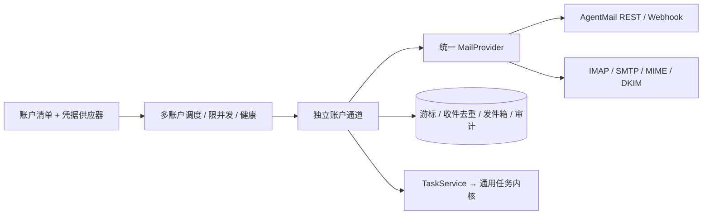

# 通用邮件基础设施

目标：同一部署连接多个邮箱，业务模块只接收统一任务，不依赖邮箱品牌。内置 AgentMail 与标准 IMAP/SMTP；支持协议开放的 Gmail、Microsoft 365、QQ/163 和企业邮箱，实际认证方式及开放权限由供应商和租户策略决定。

## 协议与认证边界

| 路径          | 官方资料与结论                                                                                                                                                                                                                                                                                       | 接入方式                                                                                              |
| ------------- | ---------------------------------------------------------------------------------------------------------------------------------------------------------------------------------------------------------------------------------------------------------------------------------------------------- | ----------------------------------------------------------------------------------------------------- |
| IMAP + SMTP   | [IMAP RFC 9051](https://www.rfc-editor.org/rfc/rfc9051.html)：序号不能当稳定标识，须联合 UIDVALIDITY 与 UID；[ImapFlow](https://imapflow.com/docs/api/imapflow-client/) 支持只读连接、UID 和 OAuth2                                                                                                  | 使用成熟客户端，不自行实现协议；持久游标、只读收件、TLS、大小与超时限制                               |
| Gmail         | [XOAUTH2](https://developers.google.com/workspace/gmail/imap/xoauth2-protocol) 支持 IMAP/SMTP，需 mail.google.com 授权范围；[Gmail API 同步](https://developers.google.com/workspace/gmail/api/guides/sync) 使用 historyId，过期需全量同步                                                           | 首先通过标准协议接入；不把 Gmail 专有同步协议放进核心                                                 |
| Microsoft 365 | [OAuth 协议说明](https://learn.microsoft.com/en-us/exchange/client-developer/legacy-protocols/how-to-authenticate-an-imap-pop-smtp-application-by-using-oauth)：IMAP/SMTP 的 scopes 不同，须匹配租户设置；[Graph delta](https://learn.microsoft.com/en-us/graph/delta-query-messages) 是逐文件夹协议 | OAuth2 凭据由可替换供应器提供；Graph 保留独立适配器扩展口                                             |
| SMTP 发送     | [Nodemailer OAuth2](https://nodemailer.com/smtp/oauth2)：可提供有效 accessToken，不同服务 scopes 不同；SMTP 接受不代表最终投递                                                                                                                                                                       | 发送前持久化 sending；断连或超时为 uncertain，不能盲目重发                                            |
| 来信可信身份  | [RFC 8601](https://www.rfc-editor.org/rfc/rfc8601.html)：Authentication-Results 只有在已建立信任边界内可信；[mailauth DKIM](https://github.com/postalsys/mailauth/blob/master/docs/dkim.md) 提供签名、域对齐及正文覆盖信息                                                                           | AgentMail 保留供应商认证元数据；IMAP 独立验证完整正文 DKIM 及 From 对齐，不信任来信自带“认证通过”字段 |

仅能收发不等于可以作为 Agent 操作者。邮件仍需显式映射到已存在身份、当前能力校验、人工确认和审计。SPF-only、未签名或被转发破坏签名的标准来信先隔离，不能为了兼容而自动信任 From。

## 架构

内部 accountId、供应商 inbox 和 RFC Message-ID 分别建模。去重、锁、游标、授权、回调和健康均按 accountId 隔离；同一账户的物理连接身份不得静默改变。旧单邮箱配置与记录保留可用。

新账户清单使用非秘密配置和 credential 引用；秘密单独放环境变量或只读凭据文件，不能通过管理接口返回。标准连接支持密码/授权码和 OAuth2 accessToken；文件凭据每次连接重读，支持外部凭据服务轮换。OAuth 应用注册、用户授权页面及供应商 token 刷新服务不属于任务内核；宿主可注入凭据供应器实现。

IMAP 首次默认从接入后的新邮件开始，可显式选择历史扫描；UIDVALIDITY 变化暂停并要求审计重置，不能把相同 UID 当旧邮件。RFC Message-ID 用于回复关联，IMAP 定位 ID 只用于读取。收取、通知、发送按账户独立加锁，调度限并发，避免大量邮箱占满任务数据库连接。

## 扩展与验证

默认邮件关闭。账户配置、凭据和故障恢复见 [运维指南](operations.md#可选邮件通道)；`tests/standard-mail.test.ts` 使用隔离 TLS 服务验证 IMAP/SMTP、STARTTLS、DKIM 和未知发送，账户隔离见 `tests/mail-accounts.test.ts`。真实账号权限与投递结果由部署方分别联调。

Gmail/Graph 原生 API、附件执行、邮箱创建及 OAuth 授权页面由独立适配器或宿主提供，当前没有内置实现。

第三方邮件供应商使用公开 `@cloud-agent/sdk/connectors`，支持完整收发、仅发送和仅接收。仅发送账户不会轮询；仅接收账户禁止启用发送。连接器模板及能力绑定见 [仓库外扩展](external-extensions.md)。
